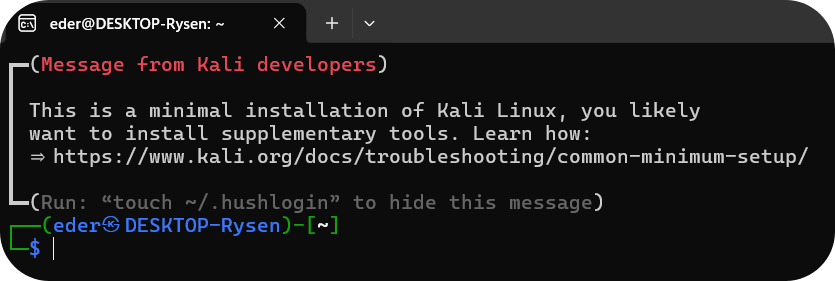
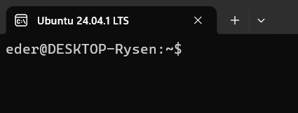
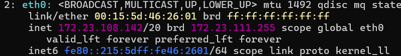

# Conectar Maquinas Linux e WSL

## *Manual resumido*

## Conexões


1. Abrir aplicativo WSL e Windows PowerShell, que pode ser:


    Exemplo (Kali): 

<br>

    Exemplo (Ubuntu):<br>


2. Ligar máquina física

3. Instalar o SSH Server na máquina física:
   
        sudo apt install openssh-server -y
        sudo systemctl enable ssh
        sudo systemctl start ssh

4. Habilitar o SSH Server no Windows:
   
        Add-WindowsCapability -Online -Name OpenSSH.Server~~~~0.0.1.0
        Start-Service sshd
        New-NetFirewallRule -Name sshd -DisplayName 'OpenSSH Server' -Enabled True -Direction Inbound -Protocol TCP -Action Allow -LocalPort 22

5. Obter ip das máquinas WSL e físicas com:<br>
Linux:

        ip addr
        exemplo:
        172.23.108.142
    <br>
Windows:


        ip config
        
        exemplo:
        Endereço IPv4. . . . . . . .  . . . . . . . : 192.168.15.7

5. Os ips e portas wsl: <br>
As mquinas linux apenas se conectam ao ip do windows.<br>
O Windows redireciona para wsl por um túnel.<br>
Exemplo de redirecionamento do ip:

        netsh interface portproxy add v4tov4 listenport=2222    listenaddress=0.0.0.0 connectport=22 connectaddress=IP_do_WSL

6. Com os ip's identificados use o nome do usuário e os ip's das máquinas:

        No WSL windows:
                nomeusuario@ipDaMaquinaLinux

        Na máquina linux física:
                nomeUsuario@ipDaMaquinaWindows


## Resultados


### Código
`Máquina física com Linux Mint acessando WSL kali (ip Windows):`

```bash
eder2@eder-POSITIVO-MOBILE:~$ ssh eder@192.168.15.3
eder@192.168.15.3's password:
Linux DESKTOP-Rysen 6.6.87.2-microsoft-standard-WSL2 #1 SMP PREEMPT_DYNAMIC Thu Jun  5 18:30:46 UTC 2025 x86_64

The programs included with the Kali GNU/Linux system are free software;
the exact distribution terms for each program are described in the
individual files in /usr/share/doc/*/copyright.

Kali GNU/Linux comes with ABSOLUTELY NO WARRANTY, to the extent
permitted by applicable law.
Last login: Fri Mar 20 08:26:06 2026 from 172.23.96.1

The programs included with the Kali GNU/Linux system are free software;
the exact distribution terms for each program are described in the
individual files in /usr/share/doc/*/copyright.

Kali GNU/Linux comes with ABSOLUTELY NO WARRANTY, to the extent
permitted by applicable law.
┏━(Message from Kali developers)
┃
┃ This is a minimal installation of Kali Linux, you likely
┃ want to install supplementary tools. Learn how:
┃ ⇒ https://www.kali.org/docs/troubleshooting/common-minimum-setup/
┃
┗━(Run: “touch ~/.hushlogin” to hide this message)
┌──(eder㉿DESKTOP-Rysen)-[~]
└─$
``` 
`Máquina WSL Kali acessando Linux Mint maquina física (ip linux físico):`
```bash
┌──(eder㉿DESKTOP-Rysen)-[~]
└─$ ssh eder2@192.168.15.13
eder2@192.168.15.13's password:

Last login: Fri Mar 20 08:56:20 2026 from 192.168.15.3
eder2@eder-POSITIVO-MOBILE:~$
